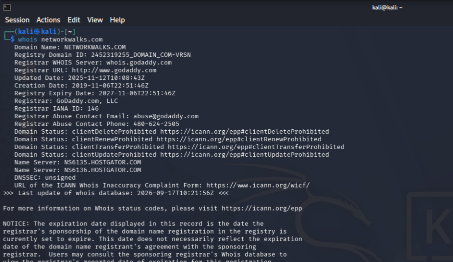
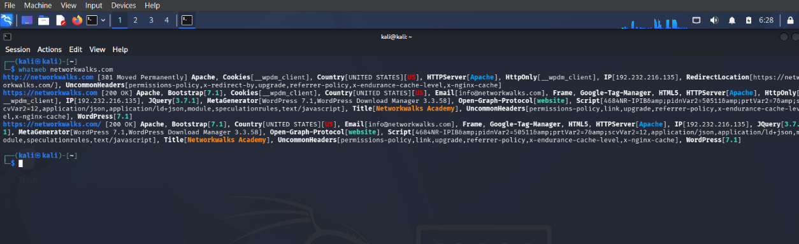
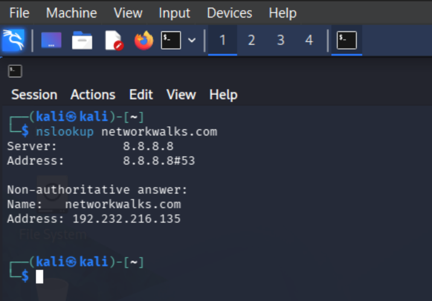
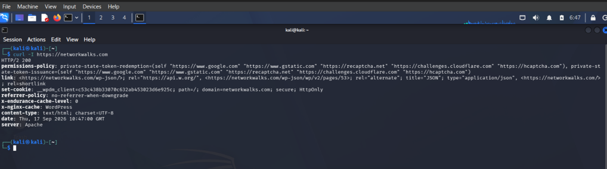
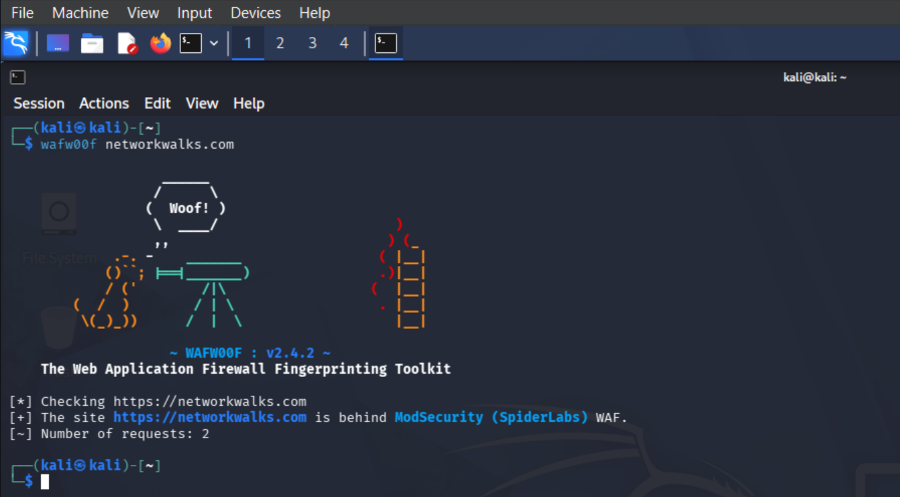
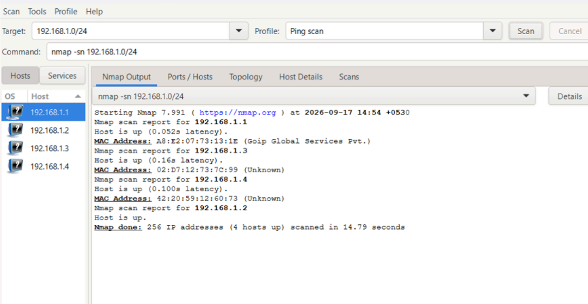
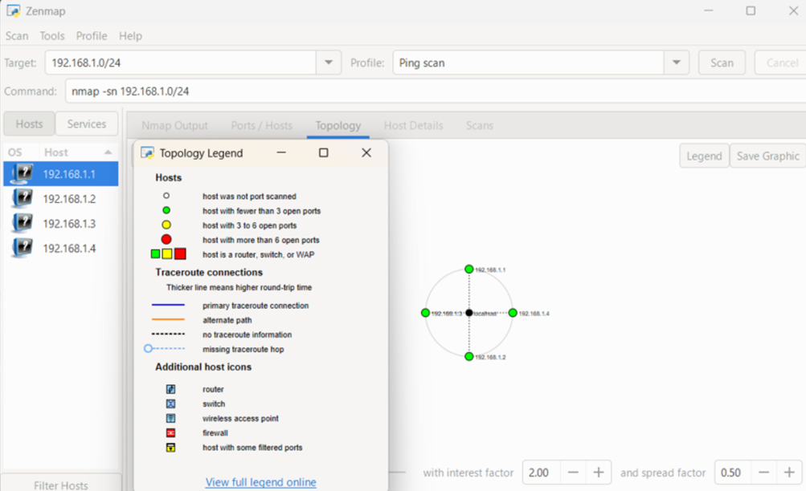
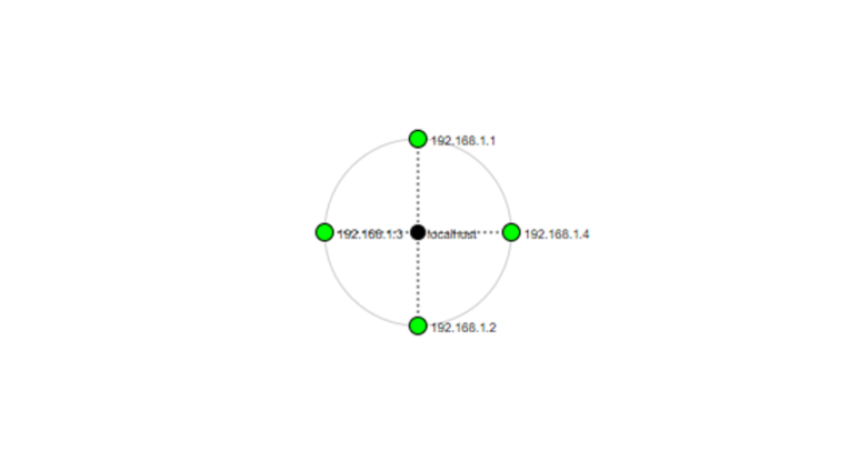

**PENETRATION TESTING REPORT**

FOOTPRINTING,GOOGLE HACKING DATABASE(GHDB) & NETWORK SCANNING PHASES

W2-PM-FINAL | CYBERSECURITY |  NETWORKWALKS

| Pentester Name(Cybersecurity Professional) | Mayur Patil |
| :---: | :---- |
| **Program/Batch** | B083-Networkwalks |
| **Date** | 18 september 2026 |
| **Modules completed** | W2-PM1 (Multiple Kali Tools) W2-PM5 (Zenmap Scanning) |
| **Client/Target** | 1\. Networkwalks (secured written permission already) 2\. My own local LAN Network |
| **Permission secured from client?** | Yes |
| **Phases covered** | **Phase 1:** Reconnaissance & Footprinting**Phase 2:** Scanning & Network Discovery **Phase 3-5:** In Progress |

# **1\. Liability Disclaimer**

I have performed these activities only on the systems & devices where I had secured written permission or the devices/systems that I own myself. All these materials are for education and research purpose only. Do not use anything from here to break the law. The instructor, the authors and Networkwalks are not responsible for what you do with this knowledge. Every action you take is your own responsibility. Misuse can lead to criminal charges, heavy fines, loss of your job and a permanent record. In most countries unauthorised access is a crime even when nothing is damaged.

# **2\. Introduction**

This report covers three practical modules completed during Week 2 of my Cybersecurity internship at Networkwalks. The first module (W2-PM1) covers footprinting the networkwalks.com domain using multiple Kali Linux tools. The second module (W2-PM5) covers scanning my own local network with Zenmap. Together, these three activities show how an attacker (or a defender testing their own exposure) moves from gathering public information, to searching for already-indexed exposed assets, to actively mapping live hosts on a network.

All footprinting commands were run in Kali Linux inside a VirtualBox virtual machine. The GHDB searches were performed using the Exploit-DB Google Hacking Database and Google Search. The network scan was performed on a Windows PC with Zenmap installed. Every step below includes the exact command or dork used, the result observed, a screenshot as evidence, and a short note on why the finding matters from an attacker's point of view.

# **3\. Tools Used**

The table below lists each tool used in this report and its purpose.4. Activities Performed

| Tool | Purpose |
| :---- | :---- |
| Kali Linux & Windows | Operating systems used for reconnaissance and scanning activities |
| WHOIS | Find domain registration details (owner, dates, name servers) |
| WhatWeb | Fingerprint web technologies (server, CMS, plugins, IP) |
| Nslookup | Resolve the domain name to its IP address using DNS |
| curl \-I | Read the HTTP response headers of the website |
| Wafw00f | Detect whether a Web Application Firewall protects the site |
| DNSRecon | Enumerate all DNS records (NS, MX, SPF, TXT, SRV) |
| Exploit-DB / GHDB | Search the Google Hacking Database for dork queries and use them on Google to find exposed devices and files |
| Zenmap (Nmap GUI) | Scan the local subnet to find live hosts, IPs and MAC addresses |
| Windows CMD | Local IP address and MAC address identification |

## **4.1 Footprinting & Reconnaissance**

I performed reconnaissance against the networkwalks.com domain using six Kali Linux tools: **WHOIS, WhatWeb, Nslookup, Curl, Wafw00f and DNSRecon**. Each tool was used to collect a different type of information about the target.

First, I used **WHOIS** to obtain publicly available domain registration information and identify the domain’s name servers. The results provided information about the domain registration and hosting infrastructure.

I then used **WhatWeb** to identify technologies used by the website. The results identified **WordPress 7.0.4** and **WP Download Manager 3.3.58**, along with other information exposed by the website.

Using **Nslookup**, I resolved the domain name to its IP address. The provided result identified **192.232.216.135**.

I used **Curl** with the \-I option to inspect the HTTP response headers. This provided additional information about the web application and exposed the WordPress REST API endpoint /wp-json/. 

Next, I used **Wafw00f** to determine whether a Web Application Firewall was protecting the website. The result identified **ModSecurity (SpiderLabs)**.

Finally, I used **DNSRecon** to enumerate DNS records. The results provided information relating to name servers, mail servers, SPF/TXT records, service records and DNS software information. 

## **4.3 Network Scanning with Zenmap**

For the third activity, I used **Zenmap** to perform network discovery on my local network. The practical required me to identify my local IP address and subnet, discover live hosts, identify their IP and MAC addresses, and generate a network topology.

I first used the Windows ipconfig command to identify my local IP address and LAN subnet. I then entered the subnet into Zenmap and selected **Ping Scan** to identify active hosts.

**Task Results**

•        Number of live hosts found: 4 (including my own PC)

•        Live host IP addresses: 192.168.1.1, 192.168.1.2, 192.168.1.3, 192.168.1.4

•        MAC addresses identified: A8:E2:07:73:13:1E (192.168.1.1 \- Goip Global Services Pvt.), 02:D7:12:73:7C:99 (192.168.1.3 \- unknown vendor), 42:20:59:12:60:73 (192.168.1.4 \- unknown vendor)

•        192.168.1.2 is my own PC, so no external MAC address was reported for it by the scan

After completing the scan, I opened the **Topology** section in Zenmap, enabled the legend and saved the network topology in PDF format as required by the practical task.

**Note:** The actual subnet, number of hosts and addresses should be replaced with the results from my own network when submitting the report.

# **5\. Risk Analysis / Impact**

Based on the information collected during the footprinting and network scanning activities, I identified the following potential risks. 

| \# | Risk / Finding | Evidence / Observation | Potential Impact | Risk Level |
| :---- | :---- | :---- | :---- | :---- |
| 1 | Web technology information exposed | WhatWeb identified WordPress 7.1 and WP Download Manager 3.3.58 | Attackers may use exposed technology/version information to identify software requiring further security review | Medium |
| 2 | Server IP address identifiable | Nslookup and WhatWeb resolved the domain to 192.232.216.135 | Reveals the network location of the web service | Low |
| 3 | HTTP technical information exposed | curl \-I returned response headers and exposed the /wp-json/ REST API endpoint | May assist technology fingerprinting and further enumeration | Low |
| 4 | WAF technology identifiable | Wafw00f identified ModSecurity (SpiderLabs) | Reveals information about the site's security architecture | Low |
| 5 | DNS infrastructure information exposed | DNSRecon identified NS/MX/SPF/TXT/SRV records and BIND software versions on both name servers | DNS and software-version information can help build a broader infrastructure and attack profile | Medium |
| 6 | Sensitive/private files indexed by search engines | An index-of dork located open directories serving downloadable PDF files with no access control | Any file placed in an open, indexed directory becomes publicly retrievable, including files never meant to be shared | Medium |
| 7 | Multiple live hosts visible on local network | Zenmap identified 4 live hosts with resolvable MAC addresses on my home network | Unknown or unauthorised devices may potentially be present on a network | Medium |

**Risk level key:**  ● Critical  ● Medium  ● 

The risks above are observations from footprinting, GHDB searching and host discovery exercises, not confirmed vulnerabilities on any system I do not own or control. No exploitation or vulnerability validation was performed as part of these modules. The presence of information such as a software version, IP address, DNS record, or an internet-indexed device does not by itself prove a system is exploitable; further authorised security testing would be required to confirm any actual vulnerability.

# **6\. Recommendations**

•        Review publicly exposed technology information: organisations should regularly review what information about their web technologies, CMS and plugins is publicly visible.

•        Keep software updated: CMS platforms, plugins and other web technologies should be regularly updated and reviewed against current security advisories.

•        Review HTTP headers: response headers should be checked to ensure unnecessary technical information is not being exposed.

•        Review DNS records regularly: DNS records should be checked periodically to ensure only required information and services are publicly exposed, and default software banners (e.g. BIND version) should be suppressed where possible.

•        Properly configure and monitor the WAF: keep ModSecurity enabled and tuned, since it already blocks naive attacks.

•        Never expose administrative or camera interfaces without authentication: default-credential or no-auth camera panels should never be reachable directly from the internet; place them behind a VPN or authenticated gateway.

•        Disable directory listing on web servers: open, browsable directories should be turned off so files are only reachable through an intended, access-controlled path.

•        Perform regular internal network discovery: periodically scan your own network to identify active devices and investigate anything unexpected.

•        Maintain network documentation: keep network topology and device information documented and updated regularly.

•        Perform security testing with authorisation: reconnaissance and scanning should only be performed against systems and networks you own or have written permission to test.

# **7\. Conclusion**

During Week 2 of my Cybersecurity internship at Networkwalks, I completed three practical modules covering footprinting, Google Hacking Database (GHDB) searching, and network scanning.

In the footprinting module, I used six Kali Linux tools to collect information about the networkwalks.com domain. I learned how WHOIS reveals domain registration details, WhatWeb identifies web technologies, Nslookup resolves domain names, curl inspects HTTP headers, Wafw00f identifies a WAF, and DNSRecon uncovers additional DNS infrastructure information.

In the GHDB module, I learned how pre-built Google dork queries can be used to search for assets that are already indexed by search engines, from unauthenticated webcam interfaces to open, browsable directories of downloadable files. This showed me how much sensitive information can be found through search engines alone, without ever touching the target system directly.

In the network scanning module, I used Zenmap to identify my own local network configuration, discover four active hosts, collect their IP and MAC address information, and generate a network topology diagram.

Overall, these exercises showed me that information gathering is a critical part of cybersecurity work. Even before attempting to interact with or test a system, a security professional can learn a significant amount about an environment by carefully analysing publicly available information, search-engine indexes, and network responses. I also learned that findings should always be documented clearly: what was performed, what was discovered, what the observation means, what risk it may create, and what can be done to reduce that risk. Finally, I learned that reconnaissance, dork-based searching and scanning must always be performed within an authorised scope; these activities were completed only against my own systems and the Networkwalks domain, for which written permission had already been secured as part of this educational internship program.

# **8\. Evidences Collected**

\-End-

**👤 Author**  
**Waqas Karim CCIE**  
Cybersecurity Professional B083  
LinkedIn: [https://www.linkedin.com/in/waqaskarim/](https://www.linkedin.com/in/waqaskarim/)  
---

**📌 Project Information**  
**Program Name:** Cybersecurity program at Networkwalks | **Week:** 02 | **Repository:** GitHub
